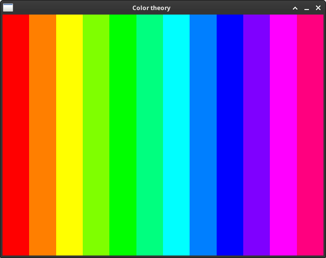
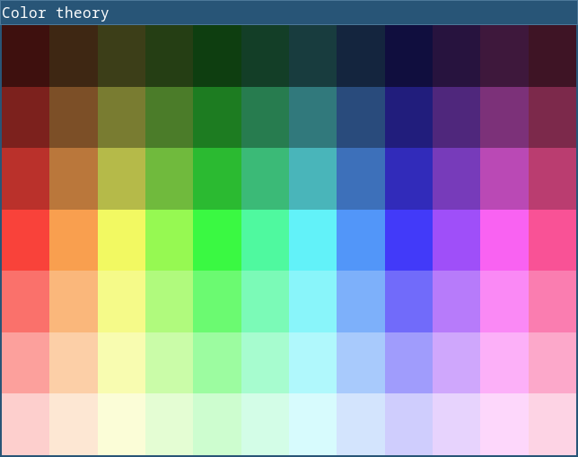

# Color theory

Create color palettes from a given initial color.

Click on a color to get its hexadecimal.

## args

You can run it with no args:

`racket main.rkt`

### fidelity

Determines the number of colors created. Note that fidelity is not the actual number of colors, but the number of iterations used to create the colors. Thus fidelity is exponential in the number of colors created.

If you must know precisely, the number of colors is:

> `(* 3 (expt 2 fidelity))`

Run `racket main.rkt --fidelity 4` for 48 colors. The default fidelity 2 creates 12 colors.

### Starting colors

You can specify one or two colors in hexadecimal which will be used as input for the colors to generate. Check out the color palette for this warm red color:

`racket main.rkt F9423A`

### Tints and shades

Specify tints and/or shades with `--tints` and `--shades`. Again, this is not the actual number, but the number of iterations (like with fidelity).

`racket main.rkt --tints 2 --shades 2 F9423A`

## Dependencies

color-theory requieres [raylib](https://www.raylib.com/). Install the wrapper with `raco setup raylib`.
